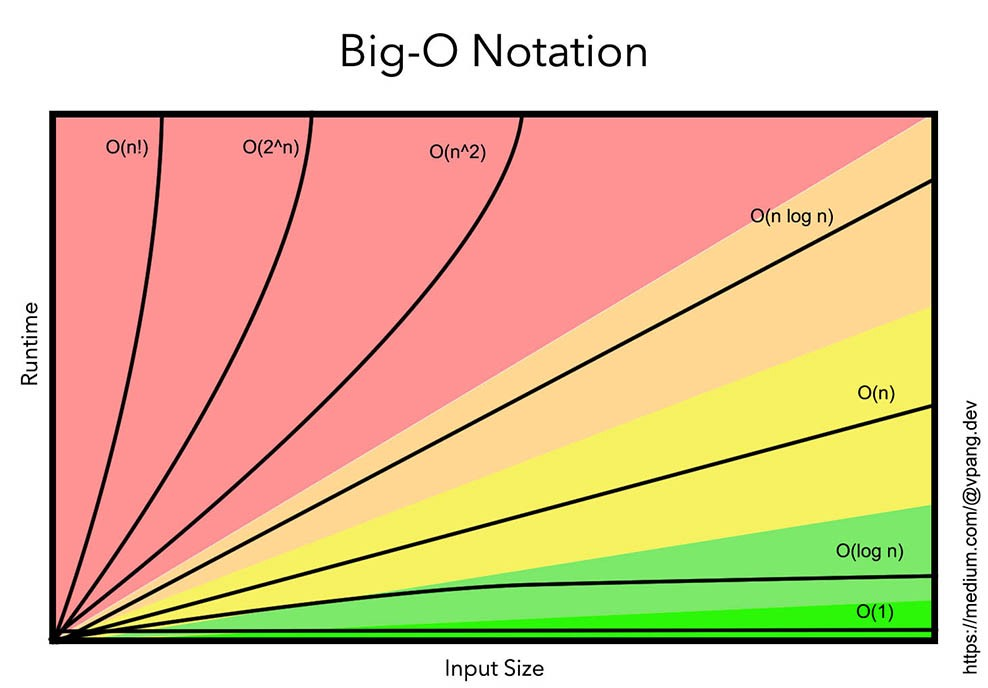

*In the parlance of the internet, I may be referred to as a noob.*

I haven't been coding for very long and the languages I have worked with are rather rudimentary. These languages, being Java & C, have some strict rules, with a big one being: all variables must be declared with a type. There are plenty of other rules but I bring this one up specifically as it is absent in Javascript. Having gotten so used to them, their absence left me with the title question: Where'd my structure go?.

## Types or lack thereof

Types are seemingly gone from Javascript, with all mentions of int’s, double’s, or boolean’s being replaced with a simple var. (There’s also alternatively let or const that come with some additional subtleties but aren’t too relevant to my point.) Now on one hand, this is a substantial improvement as there’s no longer a need to keep track of data types, streamlining the coding process. On the other hand…

<blockquote>
Human sacrifice! Dogs and cats living together! Mass hysteria!
<footer>Bill Murray (Ghostbusters 1984)</footer>
</blockquote>
 
All consistency has gone out the window. I could be working with a variable holding a simple integer, turn around, and find that it now holds a string with the entire script of the Bee Movie. Now I’m sure such an extreme situation would rarely, if ever, occur but the fact that it could is still scary. It was nice knowing that a function would always return a boolean or that it’s parameters would always be a string and an int. With Javascript though, you seemingly need to account for every possibility, but I guess that just comes with practice.

## The practice

So my current class is following a pedagogy called “Athletic Software Engineering”, which basically comes down to us receiving a small assignment each class we need to finish in a limited amount of time. To summarize my thoughts on it would amount to a lot of screaming, but to put it in English, it’s quite stressful. I don’t like time limits and the fact it’s all or nothing, with no partial credit, only adds to the horror. Now, is it effective? Yeah, probably. It certainly incentivises being very familiar with Javascript’s structure and various algorithms. However, it also rewards quick solutions over smart solutions. 

Just the other day I was doing one of the practice problems and I solved it in under 4 minutes, a really good time. The issue was my solution was horribly inefficient, being O(n^2) instead of the optimal O(n). (For those unfamiliar with asymptotic runtimes, the graph should show how bad that really is.) It wasn’t as if I wasn’t aware of this inefficiency, but it was the first solution that came to mind and time was of the essence. Part of the fun of programming for me is puzzling through the problem and coming up with an optimal solution, something that this “athletic” style prohibits.

