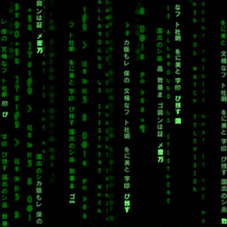

Software engineering has easily got to be the most tantilizing part of Computer Science. While there's certainly much more to it, being able to manifest your dreams onto the screen is what draws many to the field. After all, that's certainly what happened to me.

___

## Types or lack thereof

