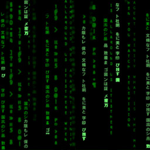

_Tedium_

That simple word alone adequately describes my experience with the code analyzing tool ESLint. Just when I've wrapped up coding a program and am preparing to submit it, ESLint has to rear their ugly head to point out the three spaces I didn't bother to place.

INSERT CODE HERE

Yeah, thanks mate. We really avoided a catastrophe there.

## Video Games
