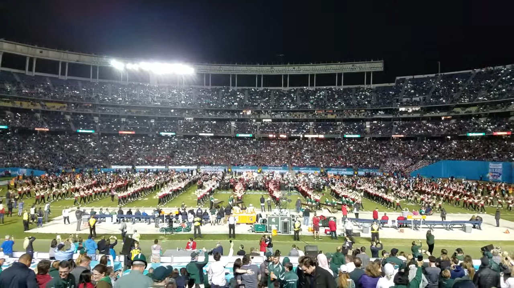
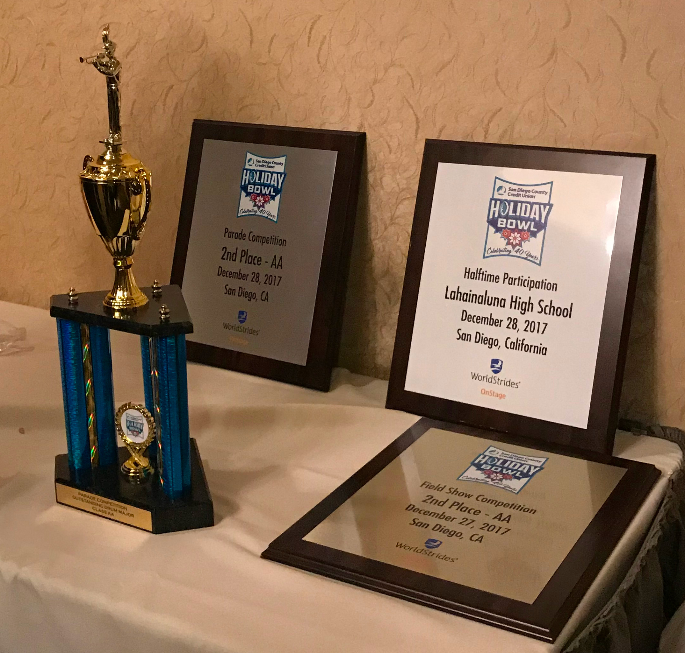

As a member of the Lahainaluna High School Marching Band, I was given the wonderful opportunity to take a trip to San Diego and perform in the Holiday Bowl halftime show. Lahainaluna was no stranger to having the band go on trips but this was the furthest they've traveled thus far. We were invited to San Diego along with many other marching bands around the country to perform at the Holiday Bowl halftime show in 2017. The Michigan State Spartans were playing the Washington State Cougars.

During our trip we have the opportunity to visit Universal Studios in Los Angeles, and we also went to Sea World in San Diego one of the days of our trip. It was about 5 years ago so there were small things about the trip that I don’t remember. I remember one of the days we had a big competition against the other high school marching bands to compete for who was able to perform their show during halftime. This was a stressful time for me, and everyone else in our high school band. Although we did not win first place in the competition, we still were able to get awards for other things. I was able to learn more about the competitive side of performing and it put my teamwork and musical skills to the test.

The final day or two of the trip, we went to Sea World where they hosted a banquet/award ceremony for all of the bands. There was another Hawaii band from Kauai that were very good as well. It was a fun experience and it was cool to interact with a bunch of new people. The trip was a very fun experience and I was excited to be able to have this opportunity to learn more about music and the ability to perform in front of many people. I do think that the Japan trip that we took a year later was my most enjoyable experience with my friends and the band we took in high school.
