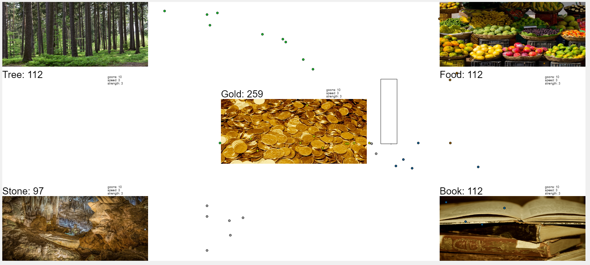

I love idle games. Like, way too much. With 7,800 hrs in Clicker Heros, 9,200 hrs in Realm Grinder, and an astounding 15,600 hrs in NGU Idle, I certainly know my way around the genre. For the uninitiated, idle games (also commonly refered to as clicker games) are games where the objective is to make some resource or number grow as much as possible. In the beginning, this usually comes down to manually clicking for each resource until you can start buying some upgrades. Soon enough, the game should start collecting resource by itself, allowing you to let it *idle*.

